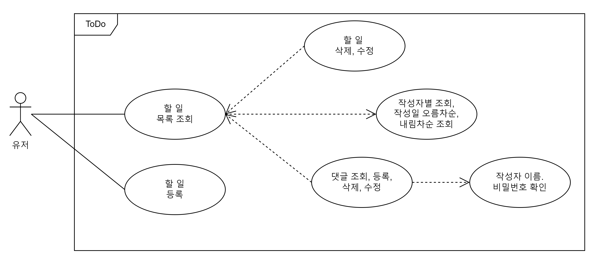
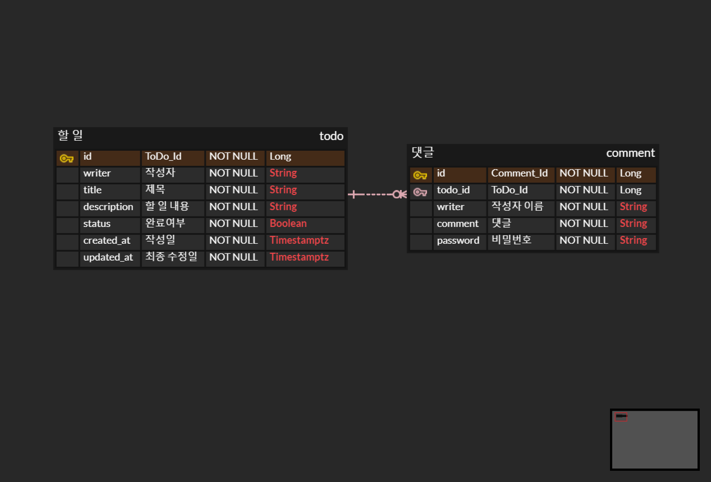

# :clipboard: To Do 앱 서버 만들기

<strong>할 일 목록을 작성해보세요</strong>

스프링 부트를 기반으로 REST API를 만드는 과제입니다.

 

## :books: 프로젝트 필수 구현 사항

#### **- 필수 구현 기능 (Step 1)**

- **할일카드 작성 기능**   
    - `할 일 제목`, `할일 내용`, `작성일`, `작성자 이름` 을 저장할 수 있습니다.
    - 저장된 할 일의 정보를 반환 받아 확인할 수 있습니다.
- **선택한 할 일 조회 기능**
    - 선택한 할 일의 정보를 조회할 수 있습니다.
    - 반환 받은 할 일 정보에는 `할 일 제목`,`할일 내용`, `작성일`, `작성자 이름`정보가 들어있습니다.
- **할 일카드 목록 조회 기능**
    - 등록된 할 일 전체를 조회할 수 있습니다.
    - 조회된 할 일 목록은 작성일 기준 내림차순으로 정렬 되어있습니다.
- **선택한 할 일 수정 기능**
    - 선택한 할 일의 `할 일 제목`, `작성자명`, `작성 내용`을 수정할 수 있습니다.
    - 수정된 할 일의 정보를 반환 받아 확인할 수 있습니다.
- **선택한 할 일 삭제 기능**
    - 선택한 게시글을 삭제할 수 있습니다.

 
     
#### **- 선택 구현 기능 (Step 2)**

- **할일카드 완료 기능 API**
    - 완료처리 한 할일카드는 목록조회시 `완료 여부`필드가 TRUE 로 내려갑니다.
    - `완료 여부` 기본값은 FALSE
- **댓글 작성 API**
    - 댓글을 작성할 때 `작성자 이름`과 `비밀번호`를 함께 받기
    - 선택한 할 일의 DB 저장 유무를 확인하기
    - 선택한 할 일이 DB에 저장되어 있다면 댓글을 등록하고 등록된 댓글 반환하기
        - 응답에서 `비밀번호`는 제외하고 반환해주세요.
- **댓글 수정 API**
    - 선택한 댓글의 DB 저장 유무를 확인하기
    - `작성자 이름`과 `비밀번호`를 함께 받아 저장된 값과 일치하면 수정 가능
    - 선택한 댓글이 있다면 댓글 수정하고 수정된 댓글 반환하기
        - 응답에서 `비밀번호`는 제외하고 반환해주세요.
- **댓글 삭제 API**
    - 선택한 댓글의 DB 저장 유무를 확인하기
    - `작성자 이름`과 `비밀번호`를 함께 받아 저장된 값과 일치하면 수정 가능
    - 선택한 댓글이 있다면 댓글 삭제하고 Client 로 성공했다는 메시지, 상태코드 반환하기
- **선택한 할 일 조회 기능 응답에 연관된 댓글 목록 추가하기**
    - **STEP 1**에서 만든 선택한 할 일 조회 api의 응답에 연관된 댓글 목록을 추가해주세요
    - 연관되지 않은 댓글은 포함되지 않아야 합니다.
    - 할 일 목록 api에는 추가하지 말아주세요.

 

#### **- 선택 구현 기능 (Step 3)**

- **할 일 목록 api에 작성일을 기준으로 오름차순, 내림차순 정렬하는 기능을 추가하기**
    - api를 요청할 때 정렬 기준(오름차순, 내림차순)을 포함하기
    - 정렬 기준을 통해 정렬한 할 일 목록 반환하기
- **할 일 목록 api에 작성자를 기준으로 필터하는 기능을 추가하기**
    - api를 요청할 때 작성자 이름을 포함하기
    - 작성자 이름이 일치하는 할 일 목록 반환하기
- **할 일 작성, 수정 api에 validation을 추가하기**
    - 할 일을 작성하거나 수정할 때, 할일 제목이 1자 이상, 200자 이내인지 검사하기
    - 할 일 본문이 1자 이상 1000자 이하인지 검사하기
    - 조건을 충족하지 않는다면 기능 실패 응답하기
- **ResponseEntity를 사용하여 api의 응답으로 적절한 코드를 반환해주세요.**
  - 조회기능 성공: status 200 OK
  - 작성기능 성공: status 201 Created
  - 수정기능 성공: status 200 OK
  - 삭제기능 성공: status 204 No Content
  - 작성, 수정기능 실패: status 400 Bad Request

 

## :clipboard: 프로젝트 필수 구현 사항(Step 1)에 따라 제작한 Step 1
- Step 1은 구현 이후 main에 병합을 하였지만 브랜치(step-1)를 통해 남겨두었습니다.
- 기본적인 CRUD 기능을 모두 구현하였습니다.
- 등록된 할 일 전체를 조회할 수 있고, 작성일 기준 내림차순으로 정렬되어 출력됩니다.
- Step 1에서는 작성일을 직접 요청을 통해 받아서 저장하도록 구현하였습니다.

 

<strong>API 명세서</strong>

|Command|Method|성공 Status Code|URI|
|---|---|:---:|---|
|Todo 목록 조회|`GET`|`200`|/todos|
|Todo 단건 조회|`GET`|`200`|/todos/{todoId}|
|Todo 생성|`POST`|`201`|/todos|
|Todo 수정|`PUT`|`200`|/todos/{todoId}|
|Todo 삭제|`DELETE`|`204`|/todos/{todoId}|

 

## :clipboard: 프로젝트 선택 구현 사항(Step 2)에 따라 제작한 Step 2
- Step 2도 구현 이후 main에 병합을 하고 브랜치(step-2)를 통해 남겨두었습니다. (현재 Step 2까지 진행했기 때문에 main과 step-2가 동일합니다.)
- Step 1에서는 작성일을 요청에서 직접 받았었지만, Step 2 에서는 엔티티가 생성될 때 작성일이 저장되도록 만들었습니다.
- 또한 최종 수정 시간 역시 같이 저장되도록 만들었습니다. 작성 시간과 최종 수정 시간이 PostrgrdSQL DB에 Timezone을 포함한 Timestamp로 저장됩니다.
- Response Body를 통해 응답을 보낼때는 <code>DateTimeFormatter.ofPattern("yyyy-MM-dd HH:mm:ss").withZone(ZoneId.of("Asia/Seoul"))</code>를 통해 한국 시간으로 바뀌어 String으로 출력됩니다.
- 댓글을 삭제할 때는 비밀번호를 Request Body에 받아서 DB에 저장된 비밀번호와 매치되는지 확인하는 과정을 거치도록 만들었습니다.
- 할 일 목록은 작성 시간 기준 내림차순으로 정렬했지만, 댓글의 경우는 나중에 작성한 댓글이 마지막에 나오도록 작성 시간 기준 오름차순으로 정렬했습니다.

 

## :clipboard: 프로젝트 선택 구현 사항(Step 3)에 따라 제작한 Step 3
- Step 3(브랜치 step-3) 구현 이후 main에 병합을 하였습니다.
- Step 2에서 요구사항을 잘못 이해하고 작성한 부분들을 수정하였습니다.
  - 할 일 목록 조회시 응답에 연관된 댓글 목록을 추가하였습니다.
  - 할 일 목록 단건 조회에는 연관된 댓글 목록이 포함되지 않습니다.
  - 이전에는 비밀번호만 확인하여 댓글 수정, 삭제가 가능하도록 만들었는데, 작성자와 비밀번호 모두 확인하도록 수정하였습니다.
- 쿼리 파라미터를 이용해 오름차순, 내림차순 정렬, 작성자 기준으로 필터링하는 것을 만들었습니다.
  - /todos?sort=desc&writer=aaa <- 왼쪽과 같은 형식으로 URI를 작성해야합니다.
  - 쿼리 파라미터를 입력하지 않으면 기본값으로 내림차순 정렬, 전체 조회를 수행합니다.
  - sort에 잘못된 값을 입력해도 내림차순으로 정렬하여 반환합니다.
  - writer에 잘못된 이름을 입력하면 404 에러를 반환합니다.
- 할 일 생성, 수정시 할 일 제목이 1\~200자, 할 일 본문이 1\~1000자 인지 검사합니다.
  - 예외 발생시 "제목은 1\~200글자 이어야합니다" 또는 "본문은 1\~1000글자 이어야합니다" 메시지를 반환합니다.

 

<strong>Use Case Diagram</strong>

 

<strong>API 명세서</strong>

|Command|Method|성공 Status Code|URI|
|---|---|:---:|---|
|Todo 목록 조회|`GET`|`200`|/todos|
|Todo 단건 조회|`GET`|`200`|/todos/{todoId}|
|Todo 생성|`POST`|`201`|/todos|
|Todo 할일 완료/진행중|`PATCH`|`200`|/todos/{todoId}|
|Todo 수정|`PUT`|`200`|/todos/{todoId}|
|Todo 삭제|`DELETE`|`204`|/todos/{todoId}|
|Comment 목록 조회|`GET`|`200`|/todos/{todoId}/comments|
|Comment 단건 조회|`GET`|`200`|/todos/{todoId}/comments/{commentId}|
|Comment 생성|`POST`|`201`|/todos/{todoId}/comments|
|Comment 수정|`PUT`|`200`|/todos/{todoId}/comments/{commentId}|
|Comment 삭제|`DELETE`|`204`|/todos/{todoId}/comments/{commentId}|

 

<strong>ERD</strong>

 

## :pushpin: 환경설정
- Language: Kotlin
- IDE: Intellij IDEA
- SDK: Eclipse Temurin 17.0.11
- Framework: Spring Boot 3.1.11
